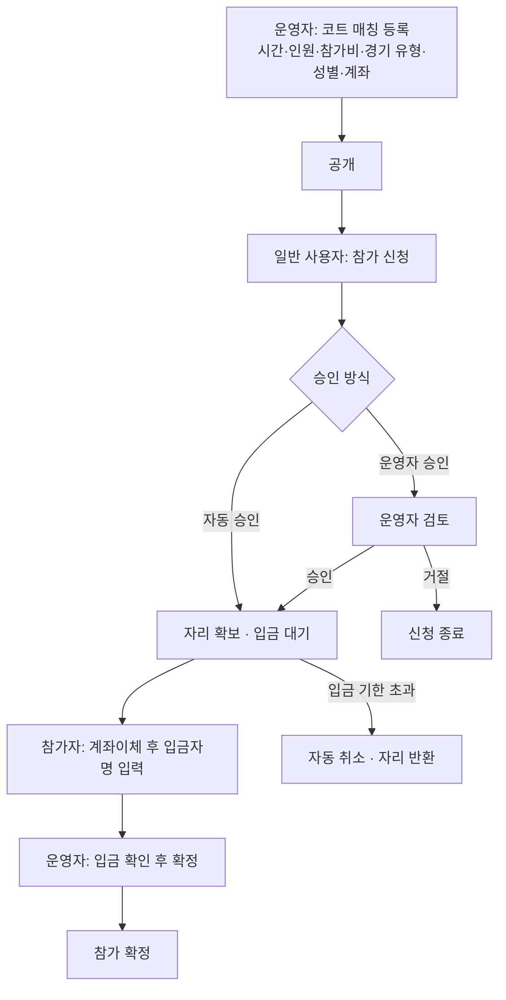

# 코트 매칭 재설계 — 운영자 주최 모델

## 0. 문서 상태

| 항목 | 내용 |
| --- | --- |
| 상태 | Draft v0.4 · 기한 확정 |
| 작성 | Claude (Cowork), 2026-09-08 |
| 대체 대상 | `03-1-court-partner-screen-spec.md`의 §3·§4.2·§4.4·§6.2·§7·§10~§12 |
| 유지 대상 | 운영자 등록·심사(OP01·OP02·IR01), 대표 코트 사진(OP07), 공급 철회(§9.4) |

사용자가 정의한 코트 매칭은 지금 구현된 것과 주최자가 다르다. 이 문서는 새 모델을
정리하고, 구현 전에 확정할 것과 개선 제안을 담는다. **아직 코드를 바꾸지 않았다.**

## 1. 무엇이 달라지는가

| | 지금 구현된 것 | 새 모델 |
| --- | --- | --- |
| 코트 매칭을 만드는 사람 | 일반 회원(세션 모집자) | **운영자** |
| 운영자가 정하는 것 | 시간·코트·비용·최대 인원 | 시간·코트·비용·최소/최대 인원·경기 유형·성별 구성·계좌 |
| 모집 조건을 정하는 사람 | 세션 모집자 | 운영자 |
| 참가 신청을 받는 사람 | 세션 모집자 | **운영자** |
| 참가 확정 | 모집자가 수락하면 끝 | 운영자 승인 → 참가자 입금 → 운영자 확정 |
| 비용 수령 | 참가자끼리 앱 밖 정산 | **운영자가 계좌이체로 수령** |
| '매칭' 탭 노출 | 노출됨 | **노출 안 함. 코트매칭 탭 전용** |

명세 §4.2 "시간 공급과 참가 승인을 분리한다", §3 역할표의 "운영자는 참가 신청
수락·거절을 하지 않는다", §12 CP03(일반 모집자의 세션 열기)은 새 모델에서 폐기된다.

### 1.1 폐기되는 코드

- `/partner-sessions/open` 화면과 `PartnerSessionCreate` 전체
- `createMatch`의 `PARTNER_COURT` 분기(모집자가 `AVAILABLE` Slot을 잠그는 흐름)
- `availableAction: "OPEN_SESSION"`과 그에 딸린 카드·상세 CTA
- `CourtSlot.status`의 `AVAILABLE → ALLOCATED` 의미(공급 배정) — 새 모델에선 공개
  즉시 모집이 시작되므로 "배정 대기" 상태가 필요 없다

### 1.2 그대로 쓰는 것

- 운영자 등록·심사, 대표 코트 사진, 공급 철회·운영 제한
- `guestFeeKrw`(게스트 1인 고정 참가비) — 최근 커밋에서 맞춰 둔 모델 그대로
- `usageNote`(현장 이용 안내)
- Match·MatchApplication·채팅 엔티티 — 아래 §4에서 재사용을 권한다

## 2. 새 흐름

## 3. 개선 제안

사용자가 정한 규칙(운영자 설정, 계좌이체, 운영자 승인/확정)을 전제로, 실제로
돌려 보면 걸릴 것들을 짚는다. **굵은 항목은 없으면 파일럿이 굴러가지 않는 것**이다.

### 3.1 **입금 기한이 반드시 필요하다**

승인 뒤 이체와 운영자 확인 기한을 나눈다. 2026-09-10 사용자 결정과 상세 실행 규칙은 `03-7-court-match-money-operations.md`를 따른다.

- 판정 전 이체 기한: `min(승인 + 6시간, 시작 - 3시간 30분)`. 확인 기한은 이체 기한 + 30분.
- 새 신청·승인에는 이체 여유가 최소 30분 필요하다. 시작까지 4시간 미만인 판정 전 구간에는 새 승인을 받지 않되 기존 입금 확인은 계속한다.
- 판정(T−3시간) 통과 후 추가 신청은 T−90분까지, 이체는 T−60분까지, 확인은 T−30분까지다.
- 새 시간대 공개는 시작 4시간 전까지 가능하다. 판정 이후 빈 매칭을 처음 공개하지 않는다.
- 기존 승인에 고지한 `paymentDueAt`은 앞당기지 않는다. `confirmationDueAt`이 없는 기존 신청의 확인 기한은 원래 `paymentDueAt`이다.
- `ACCEPTED`가 확인 기한에 도달하면 `EXPIRED_UNPAID`로 전환하고 자리를 반환한다. 상태명은 실제 은행에 입금이 없었다는 증거가 아니다.
- 실제 수령 누적액·수령 시각·참가비 충족 시각을 통장 대조로 기록해야 확정할 수 있다. 이체 기한 후 수령은 참가 확정에 사용하지 않는다.
- 정원은 `ACCEPTED + CONFIRMED`, 진행 판정은 판정 시점까지 `CONFIRMED`인 인원이다.
- 기존 일일 크론과 요청 시 보정을 유지한다. 크론 개선은 사용자 지시로 보류 중이다.

### 3.2 **최소 인원 미달을 누가 언제 결정하는지 정해야 한다**

최소 인원을 받기로 했으니 미달 시나리오가 반드시 생긴다. 제안:

**결정: 자동 처리한다.** 운영자 판단을 기다리지 않는다.

- **시작 3시간 전** 기준으로 `CONFIRMED`(입금 완료) 인원이 최소 인원에 미달이면
  서버가 코트 매칭을 자동 취소한다. 기존 `reconcile-matches` 크론에 붙인다
- 3시간으로 정한 이유: 2시간은 참가자가 이미 이동 준비 중일 수 있어 취소 통보가
  너무 늦고, 4시간은 저녁 경기의 판정이 퇴근 한참 전이라 당일에 마음먹는 사람을
  놓친다. 저녁 7시 경기면 오후 4시 판정이다
- 판정 기준을 승인이 아니라 **입금 완료**로 둔다. 돈을 내지 않은 사람 수로 진행을
  결정하면 운영자가 코트를 열었는데 실제로 오는 사람이 적을 수 있다
- 취소 시점에 참가자와 운영자 모두에게 인앱 안내를 만든다
- 이미 입금한 참가자에게는 **환불 대기** 상태가 뜬다(§3.9)
- 운영자가 "인원이 적어도 진행" 하도록 뒤집는 기능은 지금 넣지 않는다. 필요해지면
  자동 취소 직전에 여는 예외로 추가한다

시간 보정은 `/api/cron/reconcile-matches`와 참가자·운영자 상세 조회 및
신청·승인·입금 알림·입금 확인 요청에서 같은 판정 함수를 사용한다.
Match 행 잠금을 얻은 뒤 현재 시각을 읽으며, 최소 인원은 **판정 시점까지 확정된
인원**으로 센다. 기한이 지나 요청을 거절하더라도 자동 취소·입금 만료 기록과 알림은
커밋한다. **2026-09-09 사용자 결정으로 크론 작업은 보류한다.** 기존 일일 실행
설정을 유지하며, 매분 실행·유료 전환·외부 스케줄러 연동은 사용자가 재개를 요청한
뒤 진행한다. 요청 시 보정은 동작하지만 무접속 상태의 취소 알림 시각은 아직
보장하지 못한다. 재개 시 이 검증 공백을 먼저 해결한다.

### 3.3 운영자 승인은 **옵션** — 확정

참가비가 고정이고 정원이 정해져 있으면, 승인 단계는 운영자가 앱을 계속 들여다봐야
하는 부담만 만든다. 성별·경기 유형 조건은 프로필로 서버가 자동 검증할 수 있다
(이미 `genderApplicationBlock`이 그 일을 한다).

**결정: 코트 매칭마다 `자동 승인(선착순)` / `운영자 승인`을 운영자가 고른다.**

- 파일럿 기본값은 **자동 승인**. 운영자는 입금 확인만 하면 된다
- 실력·연령 등 사람이 봐야 하는 조건이 있을 때만 운영자 승인으로 전환
- 어느 쪽이든 성별·경기 유형 조건은 서버가 프로필로 자동 검증한다. 자동 승인은
  "아무나 받는다"가 아니라 "조건을 만족하면 사람 손을 거치지 않는다"는 뜻이다

### 3.4 **입금자명만으로는 대조가 안 된다 — 입금 식별코드를 권한다**

은행 앱에서 입금자명을 바꿀 수 있어서, 신청자 닉네임과 입금자명이 다르면 운영자가
누가 낸 돈인지 못 찾는다. 실무에서 흔히 쓰는 방법:

- 승인 시 참가자에게 **3자리 식별코드**를 발급하고 `홍길동742`처럼 입금자명 뒤에
  붙이도록 안내
- 운영자 화면에는 `금액 · 입금자명 · 식별코드` 목록을 그대로 보여 주고, 운영자는
  통장 내역과 대조해 확정만 누른다
- 참가자가 입력하는 값은 실제로 보낸 입금자명 하나. 나머지는 서버가 만든다

비용이 거의 안 드는데 운영 분쟁을 크게 줄인다.

### 3.5 계좌 정보는 **승인된 참가자에게만** 공개

명세 §13은 운영자 연락처 노출을 금지하는데, 계좌는 공개해야 한다. 목록·상세에서는
숨기고 승인 이후에만 보이게 한다. 일반 매칭의 `settlementAccount`가 `canSeeContact`
조건으로 하는 방식과 같아서 그대로 재사용할 수 있다.

### 3.6 성별 정원과 최대 인원의 관계를 강제한다

경기 유형이 복식(혼복·남복·여복)이면 `남 정원 + 여 정원 = 최대 인원`을 서버가
강제한다. 둘을 따로 두면 "최대 4명인데 남2·여1만 채울 수 있는" 상태가 만들어진다.
최소 인원은 성별과 무관한 별도 값으로 둔다.

### 3.9 환불은 앱이 기록만 한다 — 확정

실제 수령액과 신청 상태를 분리한다. 철회·거절·만료·전체 취소된 **미확정 신청의 실제 수령액은 전액 반환**하고 자리를 복구하지 않는다. 초과·중복 입금은 초과분을 반환한다. 확정 참가자의 자발적 취소는 §3.7의 날짜별 환불을 유지하며 초과분을 별도로 더한다.

1. 운영자가 수령 누적액·시각·대조 사유를 기록한다. 정정 전후 금액과 담당자 이력을 보존한다.
2. 반환할 잔액이 있으면 참가자가 환불 계좌를 입력한다. 종료 신청 외에 활성 신청의 초과 입금도 대상이다.
3. 운영자가 **처리 시작**으로 금액과 계좌 버전을 고정한다. 그동안 계좌 수정·수령액 정정·중복 송금을 차단한다.
4. 은행 송금 뒤 시각과 근거를 남겨 `PAID`로 표시한다. 미송금 확인은 `FAILED`, 잘못된 완료 표시는 `REVIEW`로 정정한다.
5. `REVIEW`는 실제 송금 여부가 밝혀질 때까지 추가 송금을 차단한다. 처리 결과는 덮어쓰지 않고 사건 이력을 남긴다.
6. 과거 완료 금액은 `legacyRefundPaidKrw`로 보존하여 다시 보내지 않는다. 잔액은 실제 수령에 따른 반환 의무에서 과거·현재 송금 완료 금액을 차감한다.

모든 금전 변경과 참가 상태 변경은 같은 Match 행 잠금을 사용한다. 환불 처리 시작·입금 대조·결과 저장은 `clientRequestId`로 재요청을 구분한다.

**한계를 화면에 반드시 명시한다.** 서비스는 돈을 만지지 않으므로 `환불 완료`는
운영자가 눌렀다는 기록일 뿐 송금 증명이 아니다. "실제 입금 여부는 통장에서 확인해
주세요"와 문의 경로를 함께 둔다. 이 문구가 없으면 앱이 환불을 보증하는 것처럼 읽힌다.

**환불받을 계좌는 취소가 실제로 난 뒤에만 받는다.** 계좌이체는 앱 밖에서 일어나
참가자가 어느 계좌에서 보냈는지 서버가 알 수 없다. 입금 알릴 때 미리 받아 두면
대부분 쓰지 않을 계좌 정보를 전원에게서 모으게 되므로, 필요해진 사람에게만 받는다.

### 3.7 노쇼·현장 책임 — 확정 (2026-09-09)

돈이 오가기 시작하면 바로 생긴다. 아래 셋을 확정했다. 셋 다 앱이 돈을 만지지 않고
운영자가 코트를 직접 준비한다는 전제에서 나온다.

**(a) 참가자 취소는 남은 날짜에 따라 단계별로 환불한다.** 기준은 시각이 아니라
**한국 시간 날짜**다. "이틀 전"이라고 안내해 놓고 시각 차이로 절반만 돌려주면 설명할
수 없기 때문이다.

| 취소 시점 (매칭 시작일 기준) | 환불 |
| --- | --- |
| 이틀 전까지 | 전액 |
| 하루 전 | 절반 |
| 당일 | 없음 |

- 금액은 원 단위로 **내림**한다. 취소 시점에 계산해 `refundAmountKrw`로 스냅샷을
  남기므로, 나중에 참가비가 바뀌어도 이미 취소된 건은 흔들리지 않는다.
- **취소는 시작 전까지 언제든 받는다.** 환불이 없는 구간에서도 마찬가지다. 못 가게 된
  사람이 자리를 붙잡고 있으면 운영자가 대체 참가자를 받을 수 없고 현장 인원도 어긋난다.
  신청 마감(시작 90분 전) 이후에도 취소만은 받는다.
- **자리는 언제 취소하든 돌려준다.** 정원이 차서 마감된 매칭이라면 신청 마감 전에
  한해 다시 모집 중으로 되돌린다. 마감된 채로 두면 돌려준 자리를 아무도 쓸 수 없다.
- 미확정 신청(`PENDING`·`ACCEPTED`)의 취소는 철회다. 실제 입금을 확인하면 날짜와 무관하게 전액 반환한다. 미대조 입금은 1:1 문의로 확인한다.
- 앱이 **전액**을 환불하는 경우는 앱 사유 취소, 즉 **최소 인원 미달 자동 취소**와
  **운영자 긴급 공급 철회**다(§3.9). 이때 `refundAmountKrw`는 비어 있고 전액을 뜻한다.
- 노쇼(취소하지 않고 나타나지 않음)는 환불하지 않는다. 예외는 1:1 문의로 운영자가
  개별 판단한다.

**판정을 통과한 뒤의 취소는 매칭을 취소시키지 않는다.** 최소 인원 판정은 시작 3시간
전의 1회성 관문이다. 그 시점에 확정돼 있던 사람은 이후 취소해도 판정 인원으로 계속
센다. 판정을 통과했다는 것은 진행하기로 정했다는 뜻이고 운영자는 이미 코트를 확보한
상태다. 한 명의 당일 취소로 매칭 전체가 취소되면 남은 사람의 경기가 사라지고 운영자만
손해를 보며, "당일 취소는 환불 없음"도 무의미해진다(전체가 취소되면 남은 사람은 전액을
돌려받으므로). 진행이 어려우면 운영자가 긴급 공급 철회로 취소한다.

판정 **전**의 취소는 다르다. 자리가 비고 매칭은 계속 모집하며, 시작 3시간 전 판정에서
그래도 미달이면 매칭 전체가 취소되고 남은 확정 참가자는 전액 환불 대상이 된다.

**(b) 현장 책임은 운영자에게 있다.** 코트 시설과 현장 안전은 운영자, 개인의 부상과
소지품은 각자, Rally On은 정보 제공자다. 시설 사유로 진행이 불가능하면 운영자가 긴급
공급 철회로 매칭을 취소하고 입금한 참가자는 환불 대기로 남는다(이미 구현됨).

**(c) 문의는 기존 1:1 문의로 단일화한다.** 별도 창구를 만들지 않는다. 다만 어느 코트
매칭에 대한 문의인지 알 수 있도록 `SupportInquiry`에 매칭 참조를 더한다. 운영자에게
참가자의 연락처를 노출하지 않는다는 경계는 그대로 유지한다. 내부 담당자가 문의를 맡고 회원에게 답변하거나 운영자에게 필요한 대조 요청만 전달한다. 운영자에게 문의 원문을 자동 공개하지 않는다. 답변과 해결 완료를 구분하고 추가 문의는 다시 검토한다. 반환·송금 확인이 남은 건은 해결 완료로 닫지 않는다.

### 3.8 운영자에게 참가자 정보를 어디까지 보여줄지

운영자가 승인·확정을 하려면 최소한 닉네임·성별·입금 정보는 봐야 한다. 명세 §13의
"운영자는 참가자 프로필 스냅샷·신청 메시지를 조회하지 않는다"는 새 모델에서 성립하지
않는다. 다만 **필요한 최소치**로 정하는 게 좋다: 닉네임, 성별, 입금 상태, 신청 시각.
실력 프로필과 신청 메시지는 `운영자 승인` 옵션을 쓸 때만.

## 4. 데이터 모델 제안

### 4.1 Match를 재사용한다 (권장)

새 엔티티를 만들면 참가 신청·채팅·알림·완료 처리를 전부 새로 만들어야 한다.
파일럿에 과하다. `Match.hostUserId`에 **운영자 유저**를 넣고 `courtSource =
PARTNER_COURT`로 구분하되, 매칭 목록·추천에서 제외한다.

- `getMatches` / `getRecommendedMatches`의 필터를 `courtSource: "EXTERNAL_RESERVED"`로 좁힌다
- 코트 매칭 상세를 `/matches/[id]`로 계속 쓸지, `/partner-sessions/[id]`로 옮길지는
  결정 필요(§5)

### 4.2 필드 변경

`CourtSlot`에 추가:

| 필드 | 용도 |
| --- | --- |
| `minParticipantCount` | 최소 인원 |
| `gameType` | 경기 유형(랠리/시합/혼복/남복/여복 등) |
| `maleCapacity` · `femaleCapacity` | 성별 정원(복식일 때) |
| `approvalMode` | `AUTO` / `OPERATOR` (§3.3) |
| `settlementBank` · `settlementAccountNumber` · `settlementAccountHolder` | 입금 계좌 |

**결정: 계좌는 `Court`에 한 번 저장하고, 코트 매칭 공개 시점에 값을 복사해 스냅샷으로
남긴다.** 운영자는 시설당 한 번만 입력하고, 코트 매칭을 만들 때는 자동으로 붙는다.

스냅샷이 필요한 이유는 운영자가 나중에 계좌를 바꾸면 이미 지나간 코트 매칭까지 새
계좌를 가리키게 되기 때문이다. 참가자가 실제로 입금했던 계좌와 기록이 달라지면 입금
분쟁에서 대조가 불가능하다.

**스냅샷은 `Match`의 기존 `settlementBank`·`settlementAccountNumber`·
`settlementAccountHolder`를 그대로 쓴다.** 이 세 필드는 이미 있고, 매칭 상세가
수락된 참가자에게만 보여 주는 처리(`canSeeContact`)까지 되어 있어 §3.5의 노출 규칙이
공짜로 따라온다. `CourtSlot`에는 계좌 필드를 두지 않는다.

`MatchApplication`에 추가:

| 필드 | 용도 |
| --- | --- |
| `depositCode` | 입금 식별코드(§3.4) |
| `depositorName` | 참가자가 입력한 실제 입금자명 |
| `depositClaimedAt` | 참가자가 입금했다고 알린 시각 |
| `paymentDueAt` | 입금 기한(§3.1) |
| `confirmedAt` | 운영자가 입금 확인한 시각 |

상태 흐름: `PENDING → ACCEPTED(입금 대기) → CONFIRMED` / `REJECTED` / `WITHDRAWN`
/ `EXPIRED_UNPAID` / `CANCELLED`. `CONFIRMED`와 `EXPIRED_UNPAID`가 새 상태다.

환불 대기는 별도 상태로 만들지 않는다. `CANCELLED`이면서 `confirmedAt`이 있고
`refundCompletedAt`이 비어 있으면 환불 대기다. 상태 수를 늘리지 않고 같은 정보를
표현할 수 있다.

**정원 계산이 바뀐다.** 자리를 차지하는 것은 `ACCEPTED`(입금 대기)와 `CONFIRMED`
둘 다다. `ACCEPTED`만 세는 지금의 `getAcceptedCount`를 코트 매칭에서 그대로 쓰면
초과 승인이 난다. 서버 로직 단계에서 함께 고친다.

### 4.3 CourtSlot 상태의 의미 변경

새 모델에는 "공개했지만 아직 모집이 시작되지 않은" 상태가 없다. 운영자가 공개하면
그 순간 모집이 시작된다. 그래서 상태를 이렇게 읽는다.

| 값 | 새 의미 |
| --- | --- |
| `DRAFT` | 초안 |
| `AVAILABLE` | **공개·모집 중** (Match 연결됨) |
| `ALLOCATED` | 쓰지 않음. 옛 모델의 기록 호환용으로만 남긴다 |
| `ENDED` · `BLOCKED` · `CANCELLED` | 그대로 |

enum 값 자체는 바꾸지 않는다. Postgres에서 enum 값 이름을 바꾸려면 별도 마이그레이션이
필요한데, 얻는 것이 이름뿐이라 위험 대비 이득이 없다. 대신 이 표를 근거로 남긴다.

## 5. 결정 현황

### 확정됨

| | 결정 |
| --- | --- |
| 주최자 | 운영자. 세션 모집자 레이어 폐기 |
| '매칭' 탭 노출 | 하지 않는다. 코트매칭 탭 전용 |
| 참가비 | 게스트 1인 고정, 운영자가 계좌이체로 수령 |
| 승인 방식 | 코트 매칭마다 `자동 승인` / `운영자 승인` 선택. 기본 자동 승인(§3.3) |
| 최소 인원 미달 | 시작 3시간 전, `CONFIRMED` 기준으로 자동 취소(§3.2) |
| 입금 기한 | 이체와 확인을 30분 간격으로 분리. 판정 후 신청 T−90분 / 이체 T−60분 / 확인 T−30분(§3.1) |
| 계좌 저장 | `Court`에 한 번 + 공개 시 `Match`로 스냅샷(§4.2) |
| 환불 | 미확정 종료 전액·초과 입금 반환. 송금 건에 금액·계좌를 고정하고 처리 결과를 기록(§3.9) |
| 참가자 취소 | 시작일 기준 이틀 전까지 전액, 하루 전 절반, 당일 없음. 시작 전까지 취소를 받고 자리는 돌려준다(§3.7) |
| 판정 후 취소 | 판정 시점에 확정돼 있던 인원은 이후 취소해도 판정 인원으로 센다. 매칭은 그대로 진행(§3.7) |
| 노쇼 | 취소 없이 나타나지 않으면 환불하지 않는다. 예외는 1:1 문의로 운영자 판단(§3.7) |
| 현장 책임 | 시설·안전은 운영자, 개인 부상·소지품은 각자, Rally On은 정보 제공자(§3.7) |
| 문의 | 기존 1:1 문의로 단일화. `SupportInquiry`에 매칭 참조를 더한다(§3.7) |
| 옛 `PARTNER_COURT` 데이터 | 지우지 않는다. 보존하고 새 신청만 막는 현 동작을 유지 |

### 남은 것

1. **코트 매칭 상세 경로** — `/matches/[id]`를 계속 쓸지, 코트매칭 탭 안
   (`/partner-sessions/[id]`)으로 옮길지. 매칭 탭과 완전히 분리하려면 후자가 맞지만
   채팅·활동 화면의 링크가 함께 움직인다
2. ~~**기존 `PARTNER_COURT` 데이터**~~ — 2026-09-09 확정: 보존한다. 이력·채팅·완료
   처리가 이미 동작하고 삭제는 되돌릴 수 없다
3. **운영자에게 보여 줄 참가자 정보 범위**(§3.8) — 자동 승인이 기본이면 입금 확인에
   필요한 최소치(닉네임·성별·입금 상태·신청 시각)만으로 충분할 가능성이 높다
