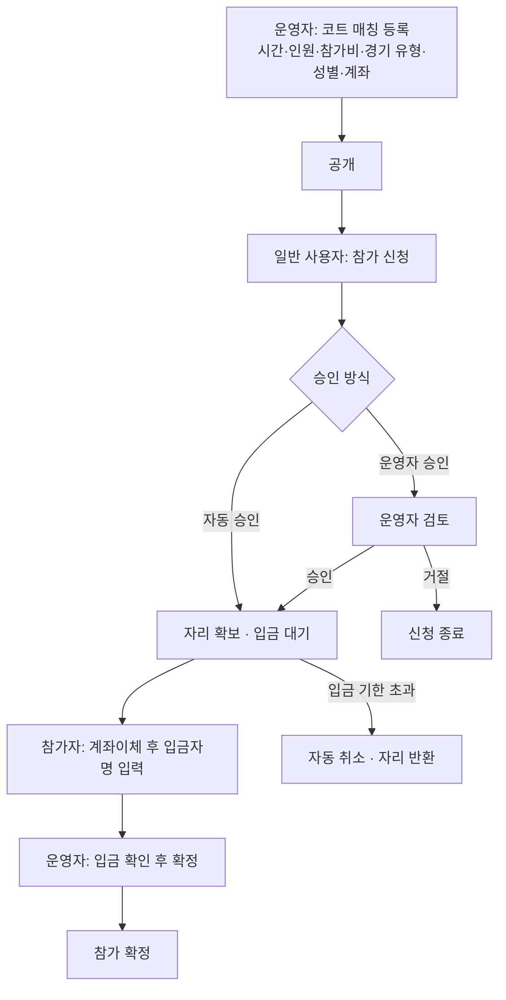

# 코트 매칭 재설계 — 운영자 주최 모델

## 0. 문서 상태

| 항목 | 내용 |
| --- | --- |
| 상태 | Draft v0.2 · 주요 결정 반영 |
| 작성 | Claude (Cowork), 2026-09-08 |
| 대체 대상 | `03-1-court-partner-screen-spec.md`의 §3·§4.2·§4.4·§6.2·§7·§10~§12 |
| 유지 대상 | 운영자 등록·심사(OP01·OP02·IR01), 대표 코트 사진(OP07), 공급 철회(§9.4) |

사용자가 정의한 코트 매칭은 지금 구현된 것과 주최자가 다르다. 이 문서는 새 모델을
정리하고, 구현 전에 확정할 것과 개선 제안을 담는다. **아직 코드를 바꾸지 않았다.**

## 1. 무엇이 달라지는가

| | 지금 구현된 것 | 새 모델 |
| --- | --- | --- |
| 코트 매칭을 만드는 사람 | 일반 회원(세션 모집자) | **운영자** |
| 운영자가 정하는 것 | 시간·코트·비용·최대 인원 | 시간·코트·비용·최소/최대 인원·경기 유형·성별 구성·계좌 |
| 모집 조건을 정하는 사람 | 세션 모집자 | 운영자 |
| 참가 신청을 받는 사람 | 세션 모집자 | **운영자** |
| 참가 확정 | 모집자가 수락하면 끝 | 운영자 승인 → 참가자 입금 → 운영자 확정 |
| 비용 수령 | 참가자끼리 앱 밖 정산 | **운영자가 계좌이체로 수령** |
| '매칭' 탭 노출 | 노출됨 | **노출 안 함. 코트매칭 탭 전용** |

명세 §4.2 "시간 공급과 참가 승인을 분리한다", §3 역할표의 "운영자는 참가 신청
수락·거절을 하지 않는다", §12 CP03(일반 모집자의 세션 열기)은 새 모델에서 폐기된다.

### 1.1 폐기되는 코드

- `/partner-sessions/open` 화면과 `PartnerSessionCreate` 전체
- `createMatch`의 `PARTNER_COURT` 분기(모집자가 `AVAILABLE` Slot을 잠그는 흐름)
- `availableAction: "OPEN_SESSION"`과 그에 딸린 카드·상세 CTA
- `CourtSlot.status`의 `AVAILABLE → ALLOCATED` 의미(공급 배정) — 새 모델에선 공개
  즉시 모집이 시작되므로 "배정 대기" 상태가 필요 없다

### 1.2 그대로 쓰는 것

- 운영자 등록·심사, 대표 코트 사진, 공급 철회·운영 제한
- `guestFeeKrw`(게스트 1인 고정 참가비) — 최근 커밋에서 맞춰 둔 모델 그대로
- `usageNote`(현장 이용 안내)
- Match·MatchApplication·채팅 엔티티 — 아래 §4에서 재사용을 권한다

## 2. 새 흐름

## 3. 개선 제안

사용자가 정한 규칙(운영자 설정, 계좌이체, 운영자 승인/확정)을 전제로, 실제로
돌려 보면 걸릴 것들을 짚는다. **굵은 항목은 없으면 파일럿이 굴러가지 않는 것**이다.

### 3.1 **입금 기한이 반드시 필요하다**

승인만 하고 입금하지 않는 사람이 자리를 무기한 점유한다. 승인 시점에 기한을 걸고,
지나면 자동으로 취소하고 자리를 돌려놓는다.

- 기본 24시간, 단 시작 24시간 이내면 `시작 2시간 전`까지로 단축
- 기한이 지나면 `EXPIRED_UNPAID`로 자동 전환(기존 `reconcile-matches` 크론 재사용)
- 정원 차감은 **승인 시점**부터. 확정까지 기다리면 초과 승인이 난다

### 3.2 **최소 인원 미달을 누가 언제 결정하는지 정해야 한다**

최소 인원을 받기로 했으니 미달 시나리오가 반드시 생긴다. 제안:

**결정: 자동 처리한다.** 운영자 판단을 기다리지 않는다.

- 시작 N시간 전(기본 12시간) 기준으로 확정 인원이 최소 인원에 미달이면 서버가
  코트 매칭을 자동 취소한다. 기존 `reconcile-matches` 크론에 붙인다
- 취소 시점에 참가자와 운영자 모두에게 인앱 안내를 만든다
- 이미 입금한 참가자에게는 **환불 대기** 상태가 뜬다. 환불 자체는 앱 밖
  계좌이체이므로, 앱은 `환불 대기 → 운영자가 환불 완료 표시`까지만 기록하고
  실제 송금을 보증하지 않는다는 문구를 함께 둔다(§5-2에서 확정 필요)
- 운영자가 "인원이 적어도 진행" 하도록 뒤집는 기능은 지금 넣지 않는다. 필요해지면
  자동 취소 직전에 여는 예외로 추가한다

### 3.3 운영자 승인은 **옵션** — 확정

참가비가 고정이고 정원이 정해져 있으면, 승인 단계는 운영자가 앱을 계속 들여다봐야
하는 부담만 만든다. 성별·경기 유형 조건은 프로필로 서버가 자동 검증할 수 있다
(이미 `genderApplicationBlock`이 그 일을 한다).

**결정: 코트 매칭마다 `자동 승인(선착순)` / `운영자 승인`을 운영자가 고른다.**

- 파일럿 기본값은 **자동 승인**. 운영자는 입금 확인만 하면 된다
- 실력·연령 등 사람이 봐야 하는 조건이 있을 때만 운영자 승인으로 전환
- 어느 쪽이든 성별·경기 유형 조건은 서버가 프로필로 자동 검증한다. 자동 승인은
  "아무나 받는다"가 아니라 "조건을 만족하면 사람 손을 거치지 않는다"는 뜻이다

### 3.4 **입금자명만으로는 대조가 안 된다 — 입금 식별코드를 권한다**

은행 앱에서 입금자명을 바꿀 수 있어서, 신청자 닉네임과 입금자명이 다르면 운영자가
누가 낸 돈인지 못 찾는다. 실무에서 흔히 쓰는 방법:

- 승인 시 참가자에게 **3자리 식별코드**를 발급하고 `홍길동742`처럼 입금자명 뒤에
  붙이도록 안내
- 운영자 화면에는 `금액 · 입금자명 · 식별코드` 목록을 그대로 보여 주고, 운영자는
  통장 내역과 대조해 확정만 누른다
- 참가자가 입력하는 값은 실제로 보낸 입금자명 하나. 나머지는 서버가 만든다

비용이 거의 안 드는데 운영 분쟁을 크게 줄인다.

### 3.5 계좌 정보는 **승인된 참가자에게만** 공개

명세 §13은 운영자 연락처 노출을 금지하는데, 계좌는 공개해야 한다. 목록·상세에서는
숨기고 승인 이후에만 보이게 한다. 일반 매칭의 `settlementAccount`가 `canSeeContact`
조건으로 하는 방식과 같아서 그대로 재사용할 수 있다.

### 3.6 성별 정원과 최대 인원의 관계를 강제한다

경기 유형이 복식(혼복·남복·여복)이면 `남 정원 + 여 정원 = 최대 인원`을 서버가
강제한다. 둘을 따로 두면 "최대 4명인데 남2·여1만 채울 수 있는" 상태가 만들어진다.
최소 인원은 성별과 무관한 별도 값으로 둔다.

### 3.7 노쇼·현장 책임을 지금 정해 두는 게 낫다

돈이 오가기 시작하면 바로 생긴다. 최소한 (a) 입금 후 불참 시 환불 여부, (b) 현장
대표 책임자, (c) 문의 창구를 코트 매칭 상세에 고정 문구로 두기를 권한다. 명세 §16
표에도 **필수 확정** 항목으로 이미 올라와 있다.

### 3.8 운영자에게 참가자 정보를 어디까지 보여줄지

운영자가 승인·확정을 하려면 최소한 닉네임·성별·입금 정보는 봐야 한다. 명세 §13의
"운영자는 참가자 프로필 스냅샷·신청 메시지를 조회하지 않는다"는 새 모델에서 성립하지
않는다. 다만 **필요한 최소치**로 정하는 게 좋다: 닉네임, 성별, 입금 상태, 신청 시각.
실력 프로필과 신청 메시지는 `운영자 승인` 옵션을 쓸 때만.

## 4. 데이터 모델 제안

### 4.1 Match를 재사용한다 (권장)

새 엔티티를 만들면 참가 신청·채팅·알림·완료 처리를 전부 새로 만들어야 한다.
파일럿에 과하다. `Match.hostUserId`에 **운영자 유저**를 넣고 `courtSource =
PARTNER_COURT`로 구분하되, 매칭 목록·추천에서 제외한다.

- `getMatches` / `getRecommendedMatches`의 필터를 `courtSource: "EXTERNAL_RESERVED"`로 좁힌다
- 코트 매칭 상세를 `/matches/[id]`로 계속 쓸지, `/partner-sessions/[id]`로 옮길지는
  결정 필요(§5)

### 4.2 필드 변경

`CourtSlot`에 추가:

| 필드 | 용도 |
| --- | --- |
| `minParticipantCount` | 최소 인원 |
| `gameType` | 경기 유형(랠리/시합/혼복/남복/여복 등) |
| `maleCapacity` · `femaleCapacity` | 성별 정원(복식일 때) |
| `approvalMode` | `AUTO` / `OPERATOR` (§3.3) |
| `settlementBank` · `settlementAccountNumber` · `settlementAccountHolder` | 입금 계좌 |

**결정: 계좌는 `Court`에 한 번 저장하고, Slot 공개 시점에 값을 복사해 스냅샷으로
남긴다.** 운영자는 시설당 한 번만 입력하고, 코트 매칭을 만들 때는 자동으로 붙는다.

스냅샷이 필요한 이유는 운영자가 나중에 계좌를 바꾸면 이미 지나간 코트 매칭까지 새
계좌를 가리키게 되기 때문이다. 참가자가 실제로 입금했던 계좌와 기록이 달라지면 입금
분쟁에서 대조가 불가능하다. 그래서 Slot의 위 세 필드는 **공개 시점에 Court에서 복사해
넣는 값**이고, 이후 Court의 계좌가 바뀌어도 다시 쓰지 않는다.

`MatchApplication`에 추가:

| 필드 | 용도 |
| --- | --- |
| `depositCode` | 입금 식별코드(§3.4) |
| `depositorName` | 참가자가 입력한 실제 입금자명 |
| `depositClaimedAt` | 참가자가 입금했다고 알린 시각 |
| `paymentDueAt` | 입금 기한(§3.1) |
| `confirmedAt` | 운영자가 입금 확인한 시각 |

상태 흐름: `PENDING → ACCEPTED(입금 대기) → CONFIRMED` / `REJECTED` / `WITHDRAWN`
/ `EXPIRED_UNPAID` / `CANCELLED`. `CONFIRMED`와 `EXPIRED_UNPAID`가 새 상태다.

## 5. 결정 현황

### 확정됨

| | 결정 |
| --- | --- |
| 주최자 | 운영자. 세션 모집자 레이어 폐기 |
| '매칭' 탭 노출 | 하지 않는다. 코트매칭 탭 전용 |
| 참가비 | 게스트 1인 고정, 운영자가 계좌이체로 수령 |
| 승인 방식 | 코트 매칭마다 `자동 승인` / `운영자 승인` 선택. 기본 자동 승인(§3.3) |
| 최소 인원 미달 | 시작 전 자동 취소(§3.2) |
| 계좌 저장 | `Court`에 한 번 + Slot 공개 시 스냅샷(§4.2) |

### 남은 것

1. **코트 매칭 상세 경로** — `/matches/[id]`를 계속 쓸지, 코트매칭 탭 안
   (`/partner-sessions/[id]`)으로 옮길지. 매칭 탭과 완전히 분리하려면 후자가 맞지만
   채팅·활동 화면의 링크가 함께 움직인다
2. **환불 상태 추적** — 자동 취소로 확정됐으므로 환불이 실제로 발생한다. 앱이
   `환불 대기 → 환불 완료`를 기록할지, 안내 문구만 두고 앱 밖에 맡길지
3. **기존 `PARTNER_COURT` 데이터** — 파일럿이면 정리해도 무방
4. **운영자에게 보여 줄 참가자 정보 범위**(§3.8) — 자동 승인이 기본이면 입금 확인에
   필요한 최소치(닉네임·성별·입금 상태·신청 시각)만으로 충분할 가능성이 높다
