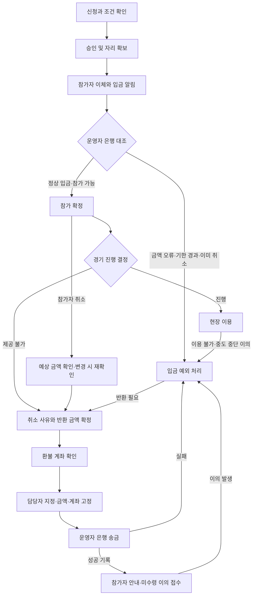

# 코트 매칭 운영·취소·환불 검토

검토일: 2026-09-10 · 코드 기준: `main` / `4d98a82`

**이 문서는 당시 코드의 검토 결과와 제안이다. 정책 정본을 대체하지 않는다.**

후속 진행(2026-09-11): R01~R03의 입금 예외·환불 실행·문의 처리와 관련 시간 경계는 사용자 결정에 따라 구현하고 로컬에서 검증했다. 확정 정책과 구현 결과는 `03-7-court-match-money-operations.md`와 갱신된 정본 `03-2`를 따른다. 아래 문제 기술은 검토 시점 기록으로 보존하며, 나머지 제안을 일괄 확정하거나 해결했다는 뜻은 아니다.

운영 반영과 후속 검토(2026-09-11): 사용자의 요청으로 첫 작업의 DB 적용·main 푸시·프로덕션 배포를 완료했다(`c012502`). R04~R06의 추가 재현, 권장 정책, 구현 경계, 법령 근거와 검증 시나리오는 `03-8-court-match-service-continuity-review.md`에 기록했다.

## 0. 결론과 검토 범위

신청·자리 확보·입금 확인·취소·환불 표시의 기본 흐름과 서버 동시성 방어는 구현돼 있다. 그러나 **실제 송금과 앱 기록이 어긋났을 때 이를 정정하고 분쟁을 끝내는 운영 절차는 아직 충분하지 않다.** 다음 화면 개선보다 이 공백을 먼저 해결하는 것을 권한다.

기준 문서는 `03-2-court-match-operator-hosted-redesign.md`와 `03-5-claude-to-codex-handoff.md`다. 운영자 주최·참가자별 직접 계좌이체 모델을 검토했다. 향후 PG 결제·플랫폼 정산을 전제로 한 `07-court-commerce-design.md`의 규칙을 현재 모델에 가져오지 않았다.

검토 방법:

- 정책, Prisma 모델, 신청·확정·취소·환불 도메인, 참가자·운영자 화면, 문의, 탈퇴, 알림, 운영자 공개 중지 코드를 대조했다.
- 날짜별 환불액, 극단적으로 짧은 입금 기한, 혼복 정원, 무료 참가비는 실제 도메인 함수·입력 스키마를 메모리에서 실행해 확인했다. DB 접속이나 쓰기는 하지 않았다.
- 나머지 재현 시나리오는 코드 경로를 추적한 결과다. 실제 은행 송금이나 운영자 대응을 재현한 결과로 해석하지 않는다.
- 인수인계의 297개 테스트·7개 E2E 통과는 **Claude가 남긴 이전 검증 결과**다. 이번 검토에서 전체 테스트·빌드·브라우저 E2E를 다시 실행하지 않았다.
- 운영 중인 문의 창구, 실제 코트 계약서, 은행 거래내역, 운영자 근무 체계는 제공되지 않았다. 저장소 밖에서 이미 처리하는 부분이 있다면 그 절차를 문서와 연결해야 한다.

**크론 보류 유지:** 기존 일일 크론과 요청 시 보정은 유지한다. 실행 주기, 유료 전환, 외부 스케줄러를 변경하지 않았다. 무접속 상태의 정시 판정·통보는 여전히 보장되지 않는다.

## 1. 현재 흐름과 돈의 의미

| 단계 | 현재 앱 동작 | 운영상 주의할 점 |
| --- | --- | --- |
| 운영자 공개 | Slot과 운영자 주최 Match를 만들고 가격·입금 계좌를 고정 | 코트 공급 가능성과 현장 진행 책임을 운영자가 맡음 |
| 신청 | 자동 승인 또는 운영자 검토 | 자동 승인은 입금 확인 자동화가 아님 |
| 승인 | `ACCEPTED`, 자리 확보, 식별코드와 입금 기한 발급 | 실제 돈이 입금됐는지는 알 수 없음 |
| 입금 알림 | 참가자가 입금자명을 입력 | 실제 거래 증명도, 참가 확정도 아님 |
| 입금 확인 | 운영자가 통장을 보고 `CONFIRMED` 처리 | 실제 입금 시각·금액과 확인 버튼 시각은 다름 |
| 진행 판정 | 시작 3시간 전까지 확정된 인원이 최소 인원 이상인지 판정 | 이후 취소로 인원이 줄어도 진행 판정은 유지 |
| 참가자 취소 | 시작 전까지 허용. 미확정은 철회, 확정은 날짜별 환불액 저장 | 실제 입금했지만 미확정인 사람은 정상 환불 경로에서 제외 |
| 매칭 전체 취소 | 최소 인원 미달 또는 운영자 공급 철회 | 당시 활성 신청을 취소. 확정된 사람만 정상 환불 대상 |
| 환불 | 참가자 계좌 입력 → 운영자 외부 송금 → 완료 표시 | 실제 송금 실패·중복·정정 절차는 별도로 필요 |

현재 자발적 취소 환불은 **KST 시작일 기준 이틀 전까지 100%, 하루 전 50%, 당일 0%**, 원 단위 내림이다. 이 규칙 자체는 사용자 확정값이며 이번에 변경하지 않았다.

## 2. 유료 운영 전에 우선 해결할 항목

### R01. 실제 입금했는데 미입금 만료되고 환불 대상에서도 빠진다

**확인된 코드 경로 + 정책 공백.**

예: 19시 경기, 입금 기한 16시. 참가자가 15:59에 이체하고 알렸지만 운영자가 16:01에 확인한다. 서버는 확인 요청을 처리하기 전에 신청을 `EXPIRED_UNPAID`로 바꾸며, 뒤늦은 확인도 거절한다. `depositClaimedAt`이 있어도 만료를 막지 않는다. 환불은 `CANCELLED`이면서 `confirmedAt`이 있는 경우만 처리하므로 이 입금은 환불 목록에 들어가지 않는다.

입금 확인 전에 참가자가 취소하거나, 그 사이 매칭 전체가 취소되는 경우에도 같은 문제가 생긴다. 현재의 “돌려줄 것이 없다”는 전제는 앱 기록에만 맞고 통장에는 맞지 않을 수 있다. 미달 판정 시 실제 입금자 수와 확정 인원 수가 달라 정상 진행 가능한 경기까지 취소될 수도 있다.

권장안:

- **입금 기한과 운영자 확인 기한을 분리**하고, 그 사이 확인 시간을 확보한다. 참가자의 신고만으로 입금 확정하지는 않는다.
- 입금 주장, 운영자가 대조한 실제 수령 금액·시각, 참가 자격을 각각 기록한다.
- 만료·철회·전체 취소 뒤에도 실제 입금 건을 대조하고 반환할 수 있는 예외 처리 경로를 둔다. 자리 반환이 곧 반환 의무 소멸을 뜻하지 않게 한다.
- 부족·초과·중복·늦은 입금, 식별코드 누락을 같은 예외 목록에서 처리한다. 초과 입금 반환에 자발적 취소 위약금을 그대로 적용하지 않는다.
- 기한 뒤 입금으로 기존 참가자의 자리를 빼앗거나 매칭을 자동으로 되살리지 않는다. 참가 복구는 최신 정원·상태와 별도 정책을 확인한다.

단순한 대안은 당분간 운영자가 확인 가능한 시간에만 소수 경기를 운영하고 모든 은행 입금을 수기로 대조하는 것이다. 다만 앱 밖 장부만 남기면 참가자는 결과를 확인할 수 없으므로 문의 답변·처리 기록은 필요하다.

근거: [입금 확인·만료 처리](/Users/zseon/Desktop/mine/rally-on/src/server/domain/court-match-service.ts:352), [환불 대상 판정](/Users/zseon/Desktop/mine/rally-on/src/server/domain/court-match.ts:109).

### R02. DB 잠금만으로 실제 환불 송금의 중복·오류를 막을 수 없다

**확인된 코드 경로 + 운영 절차 공백.**

예: 운영자가 계좌 A를 화면에서 복사한다. 참가자가 계좌 B로 수정한다. 운영자가 은행 앱에서 A로 송금한 뒤 완료 버튼을 누르면, 앱에는 B가 남은 채 완료 표시가 된다. 기존 잠금은 계좌 수정과 완료 요청의 DB 동시 실행은 막지만, 화면 확인부터 은행 송금까지의 시간을 보호하지 않는다. 두 탭에서 같은 건을 보고 각각 송금하는 경우도 은행 송금 자체를 막지는 못한다.

현재 완료 버튼은 송금 시각·실제 금액·보낸 대상·참조번호를 받지 않고 `refundCompletedAt`만 기록한다. 실수로 완료를 눌렀을 때 정정하거나 실패한 송금을 재처리하는 경로도 없다.

권장안:

- 송금 전에 `처리 시작`으로 환불 건을 맡고, **보낼 금액·수취 계좌·계좌 버전**을 고정한다. 참가자는 처리 중 변경 요청을 문의로 남긴다.
- 송금 후 실제 처리자·시각·금액·결과·최소한의 대조 정보를 기록한다. 완료 처리에는 같은 처리 요청 식별자를 사용한다.
- 잘못된 계좌, 은행 점검, 반환된 송금, 완료 오표시에는 실패·정정 이력을 추가한다. 과거 기록을 덮어쓰지 않는다.
- 참가자에게는 계속 “운영자가 송금 완료로 기록”이라고 표현하고, 미수령 문의를 받는다. 이 절차도 은행 송금의 원자성이나 중복 방지를 보증하는 것은 아니다.

근거: [환불 계좌와 완료 처리](/Users/zseon/Desktop/mine/rally-on/src/server/domain/court-match-service.ts:471), [운영자 완료 버튼](/Users/zseon/Desktop/mine/rally-on/src/features/partner/operator-court-match.tsx:117).

### R03. 예외를 받는 1:1 문의가 접수 이후에 끝나지 않는다

**저장소에서 확인된 기능 공백.**

입금 미확인, 노쇼 예외, 현장 분쟁을 모두 1:1 문의로 보내지만, 현재 모델은 문의 본문·매칭 참조·`OPEN/ANSWERED` 상태만 가진다. 담당자 배정, 운영자 전달, 답변 본문, 답변 API, 해결 결과를 이용자에게 보여주는 경로는 없다. 화면은 “확인 후 답변드릴게요”라고 약속한다.

권장안은 기존 문의를 `접수 → 담당자 확인 → 운영자 대조 → 답변/조치 → 해결`까지 완결하는 것이다. 별도 일반 채팅이나 고객센터 솔루션을 도입할 필요는 없다. 답변·담당자·처리 시각·신청 ID·환불 건 참조만으로 시작할 수 있다. 당일 이용 불가 건과 일반 문의는 처리 우선순위를 구분한다.

운영 책임도 나눠야 한다. **코트 운영자**는 입금 대조·현장 제공·환불 송금을 맡고, **Rally On 운영 담당자**는 접수 누락 방지·중재 요청·진행 추적·이의 제기를 맡는 방향을 권한다. 사용자 연락처 전체를 코트 운영자에게 공개하는 방식으로 해결하지 않는다.

환불 처리 목표 시한, 확인 시간, 휴일·야간 대응, 지연 시 인계 담당자를 정해야 한다. 예를 들어 “원칙적으로 3영업일 내 처리” 같은 내부 목표를 검토할 수 있으나, **법정 기산점과 적용 기한을 확인하기 전 확정하지 않는다.** 계좌 미입력 상태를 무기한 보류나 권리 소멸로 처리해서는 안 된다.

근거: [문의 저장·조회](/Users/zseon/Desktop/mine/rally-on/src/server/domain/support-service.ts:13), [문의 모델](/Users/zseon/Desktop/mine/rally-on/prisma/schema.prisma:437).

### R04. 탈퇴하면 남은 입금·환불 업무의 접근 경로가 끊긴다

**2026-09-12 갱신:** 사용자 승인에 따라 본인 거래 제한 접근·탈퇴 전 취소/환불 미리보기·비활성 운영자 및 담당자 인계의 구현·검증과 main·운영 DB·배포 반영을 확인했다. 현재 정책, 최신 코드의 통합 검증 결과와 별도 CI 이슈는 [03-10](03-10-account-transaction-continuity.md)을 따른다. 아래는 최초 검토 근거이며, 보존 기간·실제 운영 담당 체계는 공개 전 확정이 필요하다.

**확인된 코드 경로.**

참가자가 환불 계좌를 넣기 전에 탈퇴하면 이후 계좌 입력·문의 확인을 할 수 없다. 운영자가 입금받은 경기나 미완료 환불을 남겨 두고 탈퇴해도, 현재 탈퇴 함수는 상태를 바로 `WITHDRAWN`으로 바꾼다. 환불 완료는 해당 운영자 본인에게만 허용하므로 정상 처리자가 사라진다. 기록은 남지만 업무가 남는다.

권장안은 **서비스 탈퇴와 남은 금전 업무 종료를 분리**하는 것이다. 참가자는 탈퇴 후에도 본인 확인을 거쳐 환불을 받을 수 있어야 한다. 운영자는 새 모집을 즉시 중단하되 기존 경기·환불을 인계하고, 플랫폼 담당자가 제한된 범위에서 처리 이력을 남길 수 있어야 한다.

단순히 “환불 끝날 때까지 탈퇴 금지”로 고정하는 것은 권장하지 않는다. 탈퇴·개인정보 처리 요구와 필요한 거래 기록 보존을 함께 검토하고, 파일럿에서는 담당자 인계 절차부터 정할 수 있다. 탈퇴와 신청·입금·환불이 동시에 실행되는 경계도 확인해야 한다.

근거: [계정 탈퇴](/Users/zseon/Desktop/mine/rally-on/src/server/domain/account-service.ts:12), [비활성 계정 차단](/Users/zseon/Desktop/mine/rally-on/src/server/auth/current-user.ts:10), [환불 권한](/Users/zseon/Desktop/mine/rally-on/src/server/domain/court-match-service.ts:516).

### R05. 최소 인원을 채웠어도 광고한 경기를 할 수 없을 수 있다

**2026-09-12 갱신:** 사용자 승인으로 유형별 최소 구성, 최초 판정 기록, 판정 후 구성 부족 표시, 운영자 제공 불가 취소와 남은 참가자의 실제 수령액 전액 반환을 구현했다. 기존 공개 경기는 새 정책을 소급하지 않는다. 아래는 최초 검토 기록이며 현재 정책·검증·배포 상태는 [03-11](03-11-court-match-composition.md)을 따른다.

**입력 검증 결함 + 사용자 결정이 필요한 진행 정책.**

- 현재 스키마는 혼복 `남 4·여 0`, 최소 인원 1명을 허용한다. 실제 함수를 실행해 확인했다.
- 최대 인원의 남녀 합계만 맞추며, 혼복의 최소 성별 구성이나 복식 진행 인원을 검증하지 않는다. 운영자는 정원에 포함되는 플레이어가 아니다.
- 시작 3시간 전 판정을 통과한 뒤 취소가 이어져 한 명만 남아도 매칭은 유지된다. 이는 기존 확정 정책대로인 동작이지만, 남은 참가자는 당일 자발적 취소 시 환불 0원이고 혼자서는 약속한 경기를 할 수 없다.

권장안:

- 혼복·남복·여복이라는 이름으로 판매한다면 **실제로 그 경기를 제공할 최소 구성**을 정하고 생성·진행 판정에 반영한다. 통상 4명이 필요한 복식에서 그보다 적게 받아도 되는 상품이라면 어떤 대체 플레이를 제공하는지 사전에 명시해야 한다.
- 판정 후 전체 자동 취소를 매번 반복하는 대신, 구성 붕괴를 운영자 조치 대상으로 만들고 `대체 인원 확보 / 참가자가 동의한 대체 진행 / 운영 사유 취소·환불` 중 선택하게 한다.
- 운영자가 보장할 수 없는 경기 변경을 남은 참가자의 자발적 취소나 노쇼로 처리하지 않는다.
- 개인의 **입금 확인**과 경기의 **진행 결정**을 구분해 보여준다. 이미 판정을 통과한 경기에서 현재 인원만 보고 “미달이면 자동 취소”라고 안내하는 문구도 조정한다.

더 단순한 대안은 처음부터 실제 제공 가능한 복식 구성만 허용하고, 구성 붕괴 시 운영자가 취소하는 것이다. 운영자가 언제나 대체 선수를 제공하는 서비스까지 임의로 약속하지 않는다.

근거: [정원 검증](/Users/zseon/Desktop/mine/rally-on/src/server/domain/court-slot.ts:26), [판정 시점 인원](/Users/zseon/Desktop/mine/rally-on/src/server/domain/court-match-service.ts:157), [현재 인원으로 만드는 안내](/Users/zseon/Desktop/mine/rally-on/src/features/partner/operator-court-match.tsx:109).

### R06. 약관의 책임 범위와 참가 전 환불 안내를 다시 검토해야 한다

**법률 적용 확인 필요 + 확인된 화면·기록 공백.**

현재 약관은 개인 부상·소지품을 각자 책임으로 묶고, Rally On은 분쟁을 대신 중재하지 않는다고 적는다. 코트 결함·운영자 과실로 다친 경우까지 개인 책임으로 읽힐 여지가 있다. 계약 상대방, 서비스 제공 범위, 운영자 귀책 시 배상과 단순 환불의 관계도 구체화해야 한다.

약관법은 일정한 면책 조항과 부당하게 과중한 손해배상 예정 조항을 제한한다. 따라서 **직접 계좌이체라는 이유만으로 책임이 없어지는 것으로 설계해서는 안 된다.** [국가법령정보센터: 약관법 제7·8조](https://law.go.kr/LSW/lsLinkCommonInfo.do?chrClsCd=010202&lsJoLnkSeq=1025032399)

공공기관이 게시한 2025-12-18 소비자분쟁해결기준의 체육시설업 항목은 소비자 사유 취소, 사업자 사유 취소, 광고와 다른 제공, 신체상 피해를 구분한다. **현재 100/50/0 규칙의 적법성을 확인한 것은 아니다.** 일회성 매칭 참가권이 어떤 업종·계약에 해당하는지, 관련 반환 기준·청약철회·예외가 어떻게 적용되는지 확인해야 한다. 공공 코트 대관 기준이나 헬스장 장기 이용 기준을 그대로 복사해서는 안 된다. [부천도시공사 게시 기준](https://www.best.or.kr/fmcs/132)

통신판매중개에 해당하는지도 실제 계약·서비스 역할로 검토해야 한다. 전자상거래법은 중개자의 고지·사업자 정보 제공·분쟁 대응을 다루며, 2026년 개정도 확인 대상이다. “정보 제공자”라는 문구만으로 의무 범위를 정할 수 없다. [전자상거래법 본문](https://www.law.go.kr/LSW/lsInfoP.do?efYd=20240213&lsiSeq=260399), [2026-07-21 시행 개정문](https://law.go.kr/LSW/lsRvsDocListP.do?chrClsCd=010202&lsId=009318&lsRvsGubun=all)

제품 측면에서는 참가 신청 모달에 환불 규칙·당일 취소 시 금액·진행 조건·책임 주체가 함께 제시되지 않으며, 신청에 약관/환불 정책 버전이나 고지 확인 기록이 없다. 신청·이체 전에 핵심 조건과 정확한 마감 일시를 보여주고 그 버전을 남기는 것을 권한다. **동의를 받는다고 부당한 조건이 유효해지는 것은 아니다.**

법무 확인 항목은 판매자/중개자 역할, 공급자 정보 제공, 취소·환불·분쟁 처리 기한, 사업자 귀책 배상, 영수증 발급 주체, 안전 책임과 보험 범위다. 이번 검토는 사업자 계약서와 법적 업종 분류까지 확인한 법률 의견이 아니다.

근거: [이용약관](/Users/zseon/Desktop/mine/rally-on/src/app/terms/page.tsx:12), [참가 신청 화면](/Users/zseon/Desktop/mine/rally-on/src/features/partner/partner-session-detail.tsx:62), [신청 모델](/Users/zseon/Desktop/mine/rally-on/prisma/schema.prisma:546).

### R07. 취소·환불 같은 핵심 기록도 알림 설정에 따라 생성되지 않는다

**확인된 코드 경로 + 기존에 인정한 운영 제한.**

`recordApplicationNotification`은 매칭 알림을 끈 사용자에게 입금 기한 만료·매칭 취소·환불 완료 알림도 저장하지 않는다. 인앱 알림 생성은 앱을 닫은 사용자에게 전달됐다는 뜻도 아니다. 공급 철회는 별도 수신자 기록을 사용하므로 모든 취소를 같은 알림 경로라고 볼 수도 없다.

권장안은 **거래 상태 이력**을 알림 수신 설정과 독립적으로 남기고, 사용자가 언제든 신청 내역에서 확인하도록 하는 것이다. 홍보/선택 알림과 거래 안내의 구분 및 전달 방식은 별도로 정한다. 운영상 중요한 변경에 누가 언제 확인하고 미확인 건을 어떻게 처리하는지도 필요하다.

크론 보류 기간에는 “시작 3시간 전에 누구에게나 자동 통보”를 운영 보장으로 내세울 수 없다. 소수 파일럿은 담당자가 판정 시각과 임박한 경기를 직접 확인하는 절차를 둘 수 있지만 정시 자동화 검증을 대체하지 못한다. 외부 알림 도입이나 크론 재개는 이번 제안에 의해 승인되는 것이 아니다.

근거: [알림 생성 조건](/Users/zseon/Desktop/mine/rally-on/src/server/domain/notification-service.ts:14), [공급 철회 수신 기록](/Users/zseon/Desktop/mine/rally-on/src/server/domain/court-slot-service.ts:751), `03-5` §0.

## 3. 함께 보완할 정책과 구현

### R08. 자정을 넘기면 취소 확인 화면의 금액과 실제 환불액이 달라진다

**확인된 코드 경로·금액 계산 실행 확인.** 9월 13일 경기의 12,000원 참가비는 9월 11일 23:59:59 취소 시 12,000원, 9월 12일 00:00:00 취소 시 6,000원이다. 날짜 기준 계산 자체는 정책대로다.

문제는 화면이 조회 시점 금액을 계속 보여주고, 취소 POST는 본문 없이 서버 현재 시각으로 새 금액을 계산한다는 점이다. 12,000원을 보고 확인했는데 6,000원만 돌려받는 취소가 성립할 수 있다.

**권장:** 취소 예상 금액과 유효 기한/정책 버전을 서버가 발급하고, 실행 시 달라졌으면 취소를 확정하지 않고 새 금액을 다시 확인받는다. 서버의 현재 시각 판정은 유지한다. 클라이언트가 보낸 과거 시각을 믿어 환불율을 고정하지 않는다. 재시도는 같은 취소 결과를 확인할 수 있게 한다.

근거: [취소 미리보기](/Users/zseon/Desktop/mine/rally-on/src/server/domain/court-match-view.ts:106), [취소 POST](/Users/zseon/Desktop/mine/rally-on/src/features/partner/court-match-payment.tsx:24).

### R09. 입금할 시간이 거의 없거나 공개 즉시 취소될 경기도 만들 수 있다

**확인된 계산·코드 경로.** 19시 경기의 승인 시각이 15:59:59라면 입금 기한은 16:00, 여유는 1초다. 시작 30분 전 마감 직전의 승인도 같은 문제를 가진다. 신규 공개는 시작 전인지 만 확인하므로, 판정 시각이 이미 지난 경기의 공개도 허용된다. 새 매칭에는 확정 참가자가 없어 후속 보정에서 취소된다.

**권장:** 새 경기를 공개할 수 있는 마지막 시각, 참가자가 실제로 이체할 최소 시간, 운영자가 대조할 시간을 하나의 시간표로 정한다. 이미 진행 판정을 통과한 경기의 추가 모집은 신규 공개와 구분한다. 예시로 이체 여유 30분·대조 여유 30분을 두는 안과, 임박한 신청을 더 일찍 닫는 단순한 안을 비교할 수 있다. 이 숫자는 미확정이다.

운영자 검토 대기에도 회신 기한이 필요하다. 밤중 승인 후 6시간 만료나 휴일 확인 불가를 방지하려면 운영 가능한 시간과 모집 시간 정책을 함께 정해야 한다.

근거: [입금 기한 계산](/Users/zseon/Desktop/mine/rally-on/src/server/domain/court-match.ts:31), [공개 가능 시각](/Users/zseon/Desktop/mine/rally-on/src/server/domain/court-slot-service.ts:539).

### R10. 취소 사유가 겹치거나 경기 도중 중단되는 경우의 정산 기준이 없다

**현재 동작은 확인됨. 원하는 결과는 정책 결정 필요.**

| 상황 | 현재 결과/공백 | 권장 검토 방향 |
| --- | --- | --- |
| 전날 개인 취소로 50% 확정 후 다음 날 시설 폐쇄 | 이미 취소된 신청은 전체 취소 갱신 대상이 아니어서 50% 유지 | 기존 취소 시점과 실제 시설 문제 발생 시각을 비교하는 기준, 추가 환불 가능 여부를 정함 |
| 비가 오는데 운영자 취소 전 참가자가 먼저 취소 | 당일 개인 취소 0%가 먼저 남을 수 있음 | 시설 이용 불가 신고를 개인 변심과 구분. 입증된 운영 사유는 정정 심사 |
| 2시간 중 1시간만 진행 후 중단 | 활성 Match 공급 철회는 전체 취소 처리. 이용 시간별 환불 계산은 없음 | 부분 이용의 기록·금액·책임을 정하고 수기 조정 이력을 지원 |
| 시간/코트 면/장소 변경 요청 | 공개 후 직접 수정 금지는 있지만 동의한 대체 이용 절차는 없음 | 파일럿에서는 일방 변경 금지. 기존 건 취소·환불 후 새 신청이 단순함 |
| 운영자 귀책 시설 폐쇄 | 귀책 자동 분류는 `SCHEDULE_UNAVAILABLE`에만 적용 | 사유 선택만으로 귀책이 결정되지 않도록 시설 폐쇄·안전 위험도 검토 가능하게 함 |
| 참가자 노쇼 주장에 이의 제기 | 기본 무환불 정책은 있으나 출석·사유·증거·이의 결정 기록이 없음 | 소수 운영에서는 담당자가 사실과 결론을 남기는 절차부터 마련 |

**권장 원칙:** 확인된 미제공·운영 사유를 참가자의 자발적 취소로 강제하지 않는다. 실제 제공 시간, 먼저 발생한 사유, 이미 지급한 환불을 확인하고 추가 조정한다. 반대로 개인 취소가 나중의 전체 취소만으로 항상 전액으로 바뀌도록 자동화하지도 않는다. 정확한 우선순위와 예외는 확정이 필요하다.

우천·폭염·강풍·낙뢰·미세먼지의 판단자, 확인 시각, 증거, 현장 중단 권한도 정해야 한다. 날씨 API를 붙이는 것보다 운영자 확인과 참가자 신고·처리 절차를 먼저 갖추는 편이 단순하다. 응급 상황은 앱 답변 대기를 전제로 하지 않는다.

근거: [참가자 취소](/Users/zseon/Desktop/mine/rally-on/src/server/domain/court-match-service.ts:423), [전체 취소 대상](/Users/zseon/Desktop/mine/rally-on/src/server/domain/court-slot-service.ts:723), [운영자 귀책 분류](/Users/zseon/Desktop/mine/rally-on/src/server/domain/court-slot-service.ts:636).

### R11. 운영자 중지·코트 비활성화와 이미 받은 참가비의 후속 처리가 연결되지 않는다

**확인된 코드 경로.** 공개 승인 중지/코트 비활성화는 신규 공개를 막고 사진 정리를 예약하지만, 기존 매칭에 대해 진행 여부·참가자 안내·입금 대기 건을 함께 처리하지 않는다. 입금 확인은 활성 코트·공개 승인 조건 때문에 막힐 수 있다. 이미 확정된 참가자의 매칭은 그대로 진행 판정을 통과할 수도 있다.

운영자 공개 중지만으로 기존 환불 API가 모두 막히는 것은 아니다. 소유자 조회·환불에는 공개 승인 조건이 없으므로 **공개 제한과 계정 탈퇴를 같은 문제로 취급하면 안 된다.** 다만 무엇을 유지할지 정책과 인계가 없다.

권장안은 신규 영업 제한과 기존 계약 이행·환불 권한을 구분하는 것이다. 시설 안전 문제로 중지됐다면 대상 경기를 빠르게 확인·취소하고, 서류 갱신 같은 행정 사유라면 기존 경기 이행 가능 여부를 담당자가 판단한다. 미확인 입금도 R01의 예외 목록에 포함한다.

근거: [운영자 중지·코트 비활성화](/Users/zseon/Desktop/mine/rally-on/src/server/domain/operator-publish-control-service.ts:18), [입금 확인 전 운영 상태 검사](/Users/zseon/Desktop/mine/rally-on/src/server/domain/court-match-service.ts:120).

### R12. 무료 매칭은 허용하지만 별도 확정·환불 동작이 없다

**스키마 실행 및 코드 확인.** 참가비 0원도 허용되지만 은행 계좌 등록, 입금자명, 운영자의 입금 확인을 그대로 요구한다. 운영자가 0원을 확인 처리한 뒤 전체 취소되면, 금액 `null = 전액` 조건 때문에 0원인데도 환불 계좌를 요구할 수 있다.

파일럿 권장안은 무료를 유지한다면 승인 후 별도 입금 없이 확정하고 환불 정보를 수집하지 않는 것이다. 무료를 제공할 계획이 없다면 0원 등록을 막는 쪽이 구현은 더 단순하다. 이 결정은 임의로 내리지 않는다.

근거: [0원 허용](/Users/zseon/Desktop/mine/rally-on/src/server/domain/court-slot.ts:31), [입금 대기 화면](/Users/zseon/Desktop/mine/rally-on/src/features/partner/court-match-payment.tsx:50), [환불 대상 함수](/Users/zseon/Desktop/mine/rally-on/src/server/domain/court-match.ts:109).

### R13. 철회·만료 뒤 재신청, 대기 신청의 처리 원칙이 불명확하다

**확인된 코드 경로 + 미정 정책.** 기존 신청이 어떤 상태든 있으면 재신청이 막힌다. 실수로 철회했거나 입금 기한이 만료된 사람이 빈자리를 보고 돌아와도 신청할 수 없다. 정원 충족으로 취소된 대기 신청도 빈자리가 생겼다고 복원하지 않는다.

재신청을 허용한다면 기존 입금·취소·환불 기록을 초기화하지 말고 새 신청 회차로 구분해야 한다. 거절된 신청까지 무제한 재시도하게 할 필요는 없다. 단순한 파일럿 대안은 재신청 불가를 명확히 알리고 담당자 검토만 받는 것이다. 자동 대기열·우선권·자리 양도는 별도 정책 없이 추가하지 않는다.

근거: [기존 신청 검사](/Users/zseon/Desktop/mine/rally-on/src/server/domain/court-match-service.ts:226), [신청 유일성 제약](/Users/zseon/Desktop/mine/rally-on/prisma/schema.prisma:585).

### R14. 은행 대조와 개인정보 보관의 범위를 정해야 한다

**현재 모델의 한계 + 운영 정책 공백.** 식별코드는 매칭 안에서만 유일하다. 같은 운영자 계좌로 여러 경기를 수납하면 같은 코드·금액이 다시 나타날 수 있다. 가족 계좌 송금, 은행 표시명 잘림, 입금자명 미수정도 가능하다. 코드만 맞다고 확정하지 말고 금액·시각·신청을 함께 대조해야 한다.

환불 계좌는 실제 필요 시에만 받는 현재 원칙을 유지하되, 원 송금자와 다른 예금주를 허용할 조건과 오입금 반환 확인 절차를 정한다. 은행 거래내역 전체나 다른 사람 정보가 보이는 증빙을 일반 채팅에 올리게 해서는 안 된다.

운영자 계좌 스냅샷은 좋은 방어지만 폐쇄·오입력된 계좌를 정정할 때는 기존 기록을 보존하고 영향을 받는 신청자에게 안내해야 한다. 현재 개인정보 안내는 일반 매칭의 정산 계좌 공유 중심이며, 코트 환불 계좌의 제공 대상·처리 목적·보관/파기 기간·담당자 접근을 구체화해야 한다. 필요한 거래 기록과 불필요한 계좌 원문은 구분한다.

근거: [코드 생성](/Users/zseon/Desktop/mine/rally-on/src/server/domain/court-match.ts:76), [계좌 스냅샷](/Users/zseon/Desktop/mine/rally-on/src/server/domain/court-slot-service.ts:594), [개인정보 안내](/Users/zseon/Desktop/mine/rally-on/src/app/privacy/page.tsx:12).

### R15. 처리 대상을 빠뜨리지 않는 운영 목록과 상태 표현이 필요하다

**현재 조회·표현의 한계.** 운영자 환불 건수는 계좌를 입력한 건만 센다. 계좌 미입력 환불은 의무가 남아 있어도 조치 건수에서 빠진다. 취소·환불 자료가 매칭별로 나뉘어 있고 담당자·처리 기한·전체 미해결 금액을 한 번에 확인하기 어렵다.

추가로 발견한 표현/조회 문제:

- 자발적 취소 후 `confirmedAt`은 남으므로 참가자 상세에 채팅방 링크가 계속 나올 수 있다. 서버가 취소 멤버를 제거한 것과 UI가 맞지 않는다. 이는 확인된 링크 조건 문제이며 채팅 접근 권한이 뚫린 것으로 보지는 않는다.
- 운영자 목록의 `isAwaitingRefund` 호출에는 `refundAmountKrw`를 조회하지 않는다. 계좌 입력 조건 때문에 일반적인 당일 취소가 곧바로 잘못 집계되지는 않지만, 공통 환불 판정에 필요한 데이터를 일치시켜야 한다.
- 경기 종료·완료와 환불 업무 종료를 구분해야 한다. 완료된 경기도 미완료 환불·이의 제기를 숨기지 않는다.

권장 최소 목록은 `입금 확인 필요 / 입금 예외 / 계좌 입력 대기 / 송금 대기 / 송금 실패·정정 / 처리 기한 초과`다. 정산 플랫폼이나 복잡한 분석 기능까지 만들 필요는 없다. 금액과 사유·담당자·마지막 처리 시각만 추적해도 누락을 줄인다.

근거: [운영자 조치 건수](/Users/zseon/Desktop/mine/rally-on/src/server/domain/court-slot-service.ts:411), [취소 후 채팅 링크 조건](/Users/zseon/Desktop/mine/rally-on/src/server/domain/court-match-view.ts:116), [완료 처리](/Users/zseon/Desktop/mine/rally-on/src/server/domain/match-service.ts:961).

### R16. 정책 정본·약관·과거 문서의 구분을 더 명확히 해야 한다

`03-2`에는 아직 “코드를 바꾸지 않았다”, 이미 결정된 상세 경로를 “결정 필요”로 표시한 부분, 폐기된 게임 유형 예시가 있다. `03-1`의 유지 대상/폐기 대상과 `07`의 향후 PG 모델도 혼동될 수 있다. AGENTS의 일반 매칭 규칙과 코트 매칭 예외가 충돌하는 부분을 다음 구현자가 다시 옛 모델로 되돌리지 않도록 범위를 표시해야 한다.

이번 검토에서는 문구 충돌을 이유로 기존 구현이나 확정값을 되돌리지 않았다. 결정 후 **정책 정본 → API/ERD → 화면 → 약관/개인정보 → 테스트 기대값**을 같은 기준으로 정리하는 것을 권한다. 과거 기록은 삭제하지 않고 적용 범위를 분명히 한다.

## 4. 먼저 합의할 결정과 개발 범위

아래는 모두 제안이다. 범위 표의 ‘중간’은 스키마·API·화면·검증이 함께 바뀐다는 뜻이며 일정 추정이 아니다.

| 결정 | 권장 방향 | 단순한 대안과 차이 | 영향 |
| --- | --- | --- | --- |
| 입금 마감과 확인 지연 | 이체/대조 기한 분리, 실제 수령과 참가 상태 분리, 예외 대사 | 운영 가능한 시간에만 소수 경기 + 수기 대조. 운영 부담 큼 | 중간 이상. 금전 기록 모델·확정/만료 정책 변경 |
| 환불 실행 | 처리 시작 시 금액·계좌 고정, 완료/실패/정정 이력 | 단일 담당자 수기 실행 + 대조 기록. 확장 한계 있음 | 중간. 환불 처리 상태·버전·권한 |
| 고객 문의 | 기존 문의에 담당자·답변·처리 결과 연결 | 정해진 담당자가 수기로 확인하고 앱에 답변. 별도 고객센터 도입 불필요 | 중간. 문의 모델과 운영 화면 |
| 경기 진행 보장 | 상품 유형에 맞는 최소 구성, 판정 후 구성 붕괴 시 운영자 조치 | 복식 가능한 구성만 허용하고 불가 시 취소 | 중간. 진행 정책·정원 검증·안내 |
| 취소·환불 예외 | 공급 불가/부분 이용/실제 입금 예외를 자발적 취소와 구분 | 초기에 예외는 담당자가 검토하되 금액과 근거를 기록 | 중간. 사유·조정 이력. 환불 비율은 법무 확인 병행 |
| 탈퇴·공개 중지 | 새 이용 제한과 기존 업무 종료/인계를 분리 | 파일럿은 인계 담당자가 처리. 탈퇴 권리를 무기한 제한하지 않음 | 중간. 계정·권한·개인정보 정책 |
| 무료 경기 | 제공한다면 입금 없이 확정, 환불 계좌 미수집 | 무료 미제공이면 0원 등록 금지 | 작음~중간. 상품 범위 결정 필요 |

이 작업이 필요한 이유는 기능을 늘리기 위해서가 아니다. 사용자가 **돈을 보냈는데 참가도 환불도 확인할 수 없는 상태**를 없애고, 운영자가 약속한 경기를 제공하지 못했을 때 결과를 마무리하기 위해서다. 기존 MVP의 신청 신뢰를 직접 좌우한다. 앱 결제·PG·유료 외부 서비스는 해결의 전제조건이 아니다.

## 5. 권장 처리 흐름

참가 자격과 금전 업무를 구분하되 서로 참조하게 한다. 아래는 개념도이며 새로운 상태 이름·테이블명을 확정하는 설계가 아니다.

매칭 취소나 자리 반환은 바로 처리할 수 있어야 하지만, 그 행동 때문에 실제 수령한 돈의 확인·반환 기록이 사라지면 안 된다. 환불 권리가 확인된 경우 계좌 미입력은 실행에 필요한 정보 대기이며, 권리 유무와 구분한다.

## 6. 정책 결정 후 추가 검증할 시나리오

현재 규칙대로 테스트가 통과한다는 것과 실운영 예외를 해결할 수 있다는 것은 다르다. 아래 기대 결과를 먼저 확정한 뒤 테스트로 고정한다.

| 번호 | 시나리오 | 검증할 결과 |
| --- | --- | --- |
| 01 | 기한 전 입금·알림, 기한 후 운영자 확인 | 실제 수령이 누락되지 않고 참가/반환 결론이 남음 |
| 02 | 입금했지만 알림을 누르지 않음 | 운영자가 통장 대조로 처리 가능 |
| 03 | 입금 직후 참가 철회 또는 전체 취소 | 철회 상태와 별개로 반환 필요 여부 확인 |
| 04 | 부족·초과·중복·늦은 입금 | 차액·중복 반환, 정원 보호, 이력 유지 |
| 05 | 자정 전 취소창 열기, 자정 후 확인 | 새 금액을 확인받기 전 취소 미확정 |
| 06 | 취소 성공 후 응답 유실·재시도 | 중복 취소 없이 기존 금액·결과 확인 |
| 07 | 운영자가 계좌를 확인한 후 참가자 수정 | 송금 대상 불일치를 탐지하거나 처리 중 변경 차단 |
| 08 | 두 탭의 환불 처리 시작·완료 | 처리 중임을 표시하고 중복 완료 기록 방지 |
| 09 | 실제 송금 성공 후 완료 요청 실패 | 실제 거래 대조 후 재송금 없이 기록 복구 |
| 10 | 은행 점검·잘못된 계좌·송금 반환·완료 오표시 | 실패·정정·재처리 기록과 참가자 안내 |
| 11 | 미입금/환불 대기 중 참가자 탈퇴 | 본인 확인과 반환 절차가 남음 |
| 12 | 미래 경기/환불을 남긴 운영자 탈퇴·계정 중지 | 신규 모집 제한, 기존 건 담당자 인계 |
| 13 | 운영자 공개 승인 중지·시설 비활성화 | 기존 입금·경기·환불의 명시적 후속 처리 |
| 14 | 혼복 남 4·여 0, 복식 인원 부족 | 제공 불가능한 모집 조건 거절 |
| 15 | 진행 판정 후 취소로 경기 구성 붕괴 | 남은 참가자 보호·대체 진행 동의 또는 운영 취소 |
| 16 | 판정 직전 신규 공개, 이체 여유 1초 승인 | 충분한 여유 없으면 공개/승인 거절 또는 명확한 안내 |
| 17 | 무료 경기 정상 이용·전체 취소 | 불필요한 이체·환불 계좌 수집 없음 |
| 18 | 개인 취소 후 시설 폐쇄/우천 확인 | 사유 우선순위와 추가 환불 기준대로 처리 |
| 19 | 경기 중간 중단·시간 단축·코트 변경 | 실제 이용과 참가자 동의·금액 조정 기록 |
| 20 | 알림 설정 끈 상태의 취소·환불 | 거래 이력과 조치 필요 상태는 조회 가능 |
| 21 | 아무도 접속하지 않는 판정 시각 | 현재는 보장하지 못하는 항목으로 유지. 크론 재개 후 별도 검증 |
| 22 | 문의 접수·담당 배정·운영자 대조·답변·재문의 | 이용자가 답변과 조치 결과 확인 |
| 23 | 환불 계좌 장기 미입력·운영자 처리 지연 | 대기 금액이 목록에서 누락되지 않음 |
| 24 | 취소/만료 후 재신청, 거절 후 재시도 | 합의한 재신청 정책과 과거 금전 이력 보존 |
| 25 | 취소 후 채팅 CTA·실제 방 접근 | 화면과 서버 권한 일치 |
| 26 | 일반 매칭·과거 코트 매칭과 새 코트 매칭 | 기존 이력·채팅 보존, 새 규칙 오적용 방지 |

DB/E2E는 `03-5` §4의 전용 로컬 DB만 사용한다. 공유 DB를 초기화하거나 마이그레이션하는 것은 이 검토의 범위가 아니다.

## 7. 다음 작업 권장 순서

1. **R01·R02·R03부터 정책을 정한다.** 실제 입금의 판단, 만료 후 반환, 환불 실행, 담당자와 문의 답변을 하나의 작은 운영 절차로 묶는다.
2. R04·R05·R06을 함께 확정한다. 탈퇴/중지 시 인계, 약속한 경기 제공 범위, 취소 조건·계약 역할을 정한다. 법무 확인이 필요한 부분은 코드로 먼저 고정하지 않는다.
3. 확정된 범위만 정본·ERD·API에 반영하고, 입금 예외/환불/문의부터 구현한다. R08의 금액 재확인, R09의 시간 검증을 같은 흐름에서 보완한다.
4. 참가자·운영자 화면과 거래 안내를 맞추고 위 경계 사례를 전용 DB와 브라우저에서 검증한다. 기존 테스트도 회귀 확인한다.
5. 실제 송금 없는 모의 운영에서 담당자가 입금 예외·환불 실패·연락 두절까지 처리해 본다. 그 다음 유료 운영 준비 여부를 판단한다.

**최초 검토 단계에서는 이 문서만 작성했다. 후속 구현·검증 범위와 미반영 사항은 `03-7`의 진행 기록을 확인한다.**
